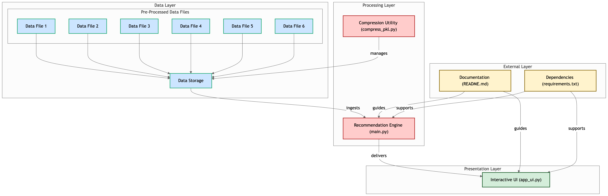

# Collaborative Filtering Recommender System

A hybrid product recommendation system leveraging both user-based and item-based collaborative filtering. The system predicts user preferences for products and provides personalized recommendations using a clean and user-friendly web interface.

## Features
- **Hybrid Recommendation Model**: Combines user-based and item-based collaborative filtering.
- **Interactive User Interface**: Built with Streamlit for dynamic interactions.
- **Custom User and Product Mappings**: Provides user-friendly names for users and products.
- **Deployed Online**: Access the live app at [Streamlit App](https://collaborativefilteringrecommendersystem.streamlit.app/).

